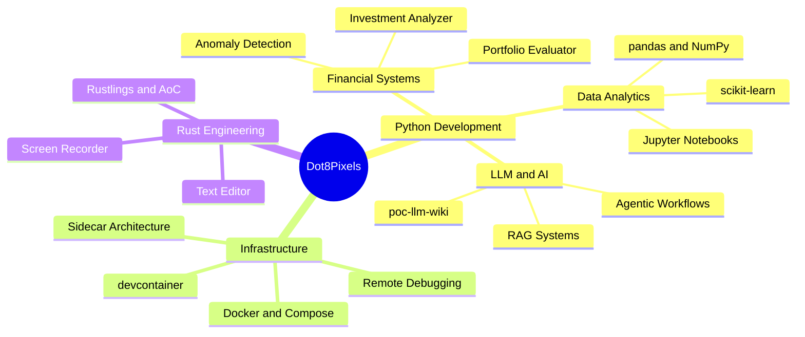

  

&nbsp;

&nbsp;

&nbsp;

&nbsp;

 

---

## About

> [!IMPORTANT]
> *Python for domain logic and rapid iteration — Rust when correctness and speed both matter.*

Python developer based in **Thailand**[^1], focused on the intersection of **financial systems**, **data engineering**, and **applied machine learning**. I build tools that analysts and engineers actually rely on — investment analyzers, production data pipelines, and anomaly detection systems.

Alongside applied work, I've been systematically deepening **Rust** proficiency: from building a text editor and screen recorder from scratch to completing Rustlings, Advent of Code, and a full backend course.

<kbd>&nbsp;Quick profile&nbsp;</kbd>

 

|                    |                                                                                         |
| ------------------ | --------------------------------------------------------------------------------------- |
| 🏠 **Based in**     | Thailand (UTC +7)                                                                       |
| 💼 **Status**       | Open to work                                                                            |
| 🎯 **Domains**      | Financial Systems · Data Analytics · LLM Applications                                   |
| 🧰 **Daily stack**  | <kbd>Python</kbd> &nbsp;<kbd>Docker</kbd> &nbsp;<kbd>Git</kbd> &nbsp;<kbd>VS Code</kbd> |
| 📦 **Repositories** | 49+ public                                                                              |
| 📧 **Contact**      | napatsriz@gmail.com                                                                     |

 

---

## What I Build

Every financial system I build eventually needs a performance measure[^2]:

$$\text{Sharpe Ratio} = \frac{\mu_p - r_f}{\sigma_p}$$

 

---

## Stack

  &nbsp;&nbsp;
  &nbsp;&nbsp;
  &nbsp;&nbsp;
  &nbsp;&nbsp;
  &nbsp;&nbsp;
  &nbsp;&nbsp;
  

<b>Full breakdown — 6 categories extracted from 49+ repositories</b>

 

| Category           | Technologies                                                                                                                                                                                                                                                                                                                                                                                                                                                                                                                                                                                                                                              |
| ------------------ | --------------------------------------------------------------------------------------------------------------------------------------------------------------------------------------------------------------------------------------------------------------------------------------------------------------------------------------------------------------------------------------------------------------------------------------------------------------------------------------------------------------------------------------------------------------------------------------------------------------------------------------------------------- |
| **Languages**      |                                                                                                                                           |
| **Data & ML**      |       |
| **LLM / AI**       |                                                                                                                                                                                                                                                                                                                       |
| **Infrastructure** |                                                                                                                           |
| **Applications**   |                                                                                                                                                                                                                   |
| **Tooling**        |                                                                                                                                                                                                                                             |

 

---

## Activity

  

 

---

## Trophies

  

 

---

## Stats

<table><tr>
<td></td>
<td></td>
</tr></table>

 

 

---

## Latest Repositories

> [!TIP]
> Auto-updated daily by GitHub Actions — always showing the 5 most recently pushed repos.

<!-- REPOS:START -->
| Repository | Description | Language | Updated |
|---|---|---|---|
| [my-doppelganger](https://github.com/Dot8Pixels/my-doppelganger) | Doppelganger Agent | — | May 2026 |
| [second-brain](https://github.com/Dot8Pixels/second-brain) | A personal knowledge base maintained by an LLM agent. The LLM writes and maintains all wiki content; you curate sources and ask questions. | — | May 2026 |
| [poc-llm-wiki](https://github.com/Dot8Pixels/poc-llm-wiki) | POC for Karpathy's LLM Wiki | — | May 2026 |
| [sidecar](https://github.com/Dot8Pixels/sidecar) | poc for sidecar container | Python | Apr 2026 |
| [poc-anomaly-detection](https://github.com/Dot8Pixels/poc-anomaly-detection) | — | HTML | Apr 2026 |
<!-- REPOS:END -->

<a href="https://github.com/Dot8Pixels?tab=repositories">View all 49+ repositories →</a>

 

---

 

---

Building in public · Thailand · Open to work

[^1]: UTC +7 — available for async collaboration worldwide.
[^2]: Where $\mu_p$ is portfolio return, $r_f$ is risk-free rate, and $\sigma_p$ is portfolio standard deviation.
